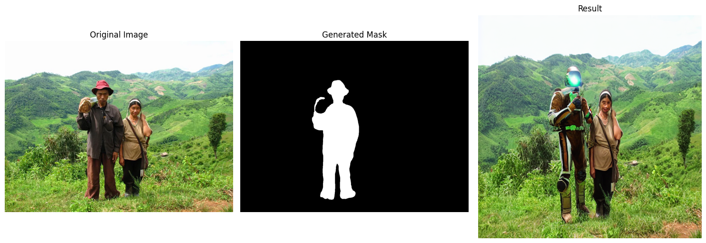

# Image Inpainting and Object Replacement

This project utilizes advanced deep learning models to replace objects in images using **Stable Diffusion** and **Segment Anything Model (SAM)**. The result is an AI-generated image where a specified object is replaced by a new object described through a textual prompt.

---

## **Output Example**

The program generates results like this:



---

## **Features**
1. Automatically identifies objects in the input image using SAM.
2. Generates a mask for the selected object.
3. Replaces the object with a new one using the Stable Diffusion inpainting pipeline.
4. Displays the original image, mask, and final result side-by-side.

---

## **Setup Instructions**

### **1. Clone the Repository**
```bash
$ git clone <repository_url>
$ cd <repository_name>
```

### **2. Create a Virtual Environment**
```bash
$ python -m venv venv
$ source venv/bin/activate  # For Linux/Mac
$ venv\Scripts\activate   # For Windows
```

### **3. Install Dependencies**
```bash
$ pip install -r requirements.txt
```

---

## **Usage**

### **Steps to Run**
1. **Download the SAM Model:**
   - The script will automatically download the required SAM model weights.

2. **Provide Input Parameters:**
   - **Image Path or URL**: Path to the image you want to edit.
   - **Target Object**: Description of the object to replace (e.g., "person").
   - **Replacement Prompt**: Text describing the object to replace with (e.g., "Two people wearing spacesuits standing in a green mountainous landscape").

3. **Run the Script:**
```bash
$ python script.py
```

4. **Output:**
   - Displays the original image, generated mask, and final result.

---

## **Dependencies**

This project uses the following packages:

- torch (2.5.1+cu124)
- torchvision (0.20.1+cu124)
- torchaudio (2.5.1+cu124)
- diffusers (0.31.0)
- transformers (4.47.1)
- segment-anything (1.0)
- numpy (2.2.0)
- matplotlib (3.10.0)
- opencv-python (4.10.0.84)
- Pillow (11.0.0)
- requests (2.32.3)

See `requirements.txt` for the complete list of dependencies and their versions.

---

## **requirements.txt**

Below is the content for `requirements.txt`:

```
accelerate==1.2.1
certifi==2024.12.14
charset-normalizer==3.4.0
colorama==0.4.6
contourpy==1.3.1
cycler==0.12.1
diffusers==0.31.0
filelock==3.16.1
fonttools==4.55.3
fsspec==2024.12.0
huggingface-hub==0.27.0
idna==3.10
importlib_metadata==8.5.0
Jinja2==3.1.4
kiwisolver==1.4.7
MarkupSafe==3.0.2
matplotlib==3.10.0
mpmath==1.3.0
networkx==3.4.2
numpy==2.2.0
opencv-python==4.10.0.84
packaging==24.2
pillow==11.0.0
pip==24.3.1
psutil==6.1.1
pyparsing==3.2.0
python-dateutil==2.9.0.post0
PyYAML==6.0.2
regex==2024.11.6
requests==2.32.3
safetensors==0.4.5
segment-anything==1.0
setuptools==65.5.0
six==1.17.0
sympy==1.13.1
tokenizers==0.21.0
torch==2.5.1+cu124
torchaudio==2.5.1+cu124
torchvision==0.20.1+cu124
tqdm==4.67.1
transformers==4.47.1
typing_extensions==4.12.2
urllib3==2.2.3
zipp==3.21.0
```

---

## **References**
- [Stable Diffusion](https://github.com/CompVis/stable-diffusion)
- [Segment Anything Model](https://github.com/facebookresearch/segment-anything)

---

(Might show black image as a result of the model)
